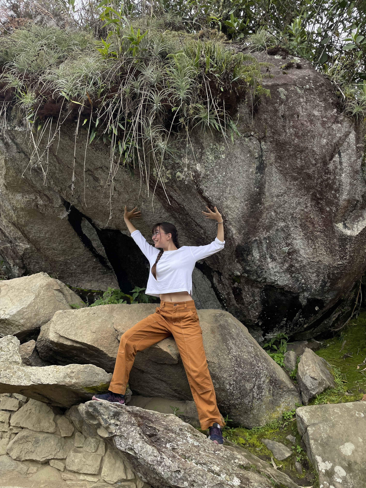

# Template Portfolio
This will be your portfolio repository. Use this as a [template repository](https://docs.github.com/en/repositories/creating-and-managing-repositories/creating-a-template-repository) and customize it to your own tastes. We gave you a starting point with a space to describe yourself and a link to where your assignment 1 file can be.

# About Me
* My name is Tori Kelley, and I'm a senior in 6-4. [Here's](https://akatorik.wordpress.com/) a link to my site. it's nice to meet you!
*

Some fun facts about me:
1. I walked across a state in a day.
2. I have 3 sisters.
3. I have slight bananaphobia.

# Table of Contents
[Link to Assignment 1](assignments/assignment1.md)
